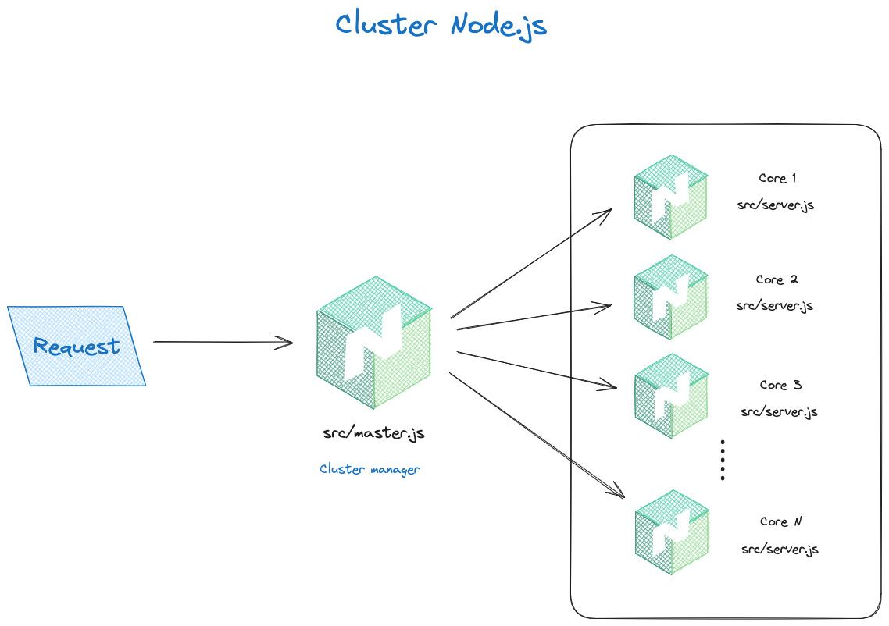

# Cluster
## Introduction

Le cluster Node.js est un module qui permet de créer des processus enfants qui partagent tous le même port d'écoute.
Il est très utile pour paralléliser des tâches sur des applications HTTP, et ainsi optimiser les performances de notre application.
