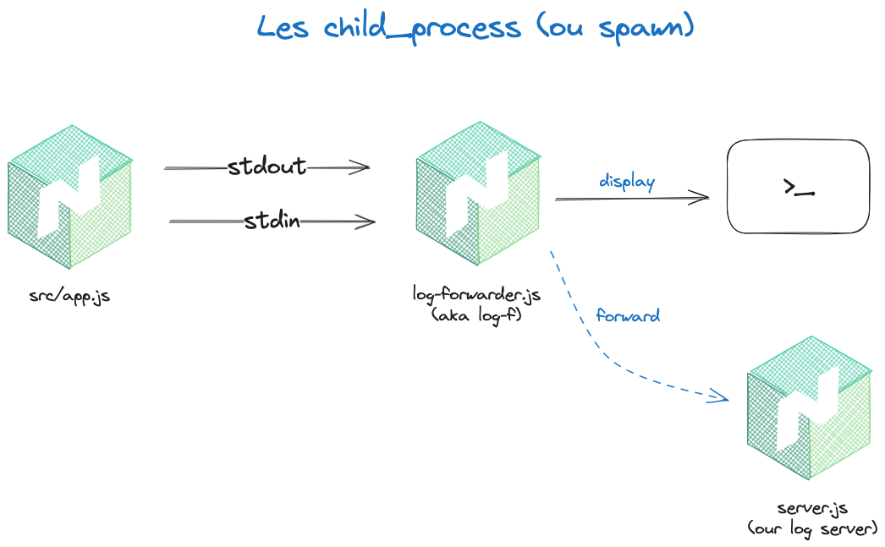

# Avantage & inconvénients

## Avantages

::: tip Sympa !
- Simple à mettre en place,
- Scalable,
- Permet de paralléliser des tâches.
:::

## Inconvénients

::: warning Hé voué !
L'API `child_process` est assez bas niveau et peut-être difficile à utiliser,
dès lors que l'on souhaite établir une communication entre le processus principal et le processus enfant.
Les échanges de données se font exclusivement via des flux (stream) via `stdout`, `stderr`, `stdin`.

  
Comment faire ?

  Il faut mettre en place la sérialisation et la désérialisation des messages.

::: 

::: warning Attention ! 
L'exécution sur Windows est peut être différente de Mac & Linux selon les commandes utilisées.
:::

## Modules NPM

Gestion de processus :

- [execa](https://www.npmjs.com/package/execa)
- [forever](https://www.npmjs.com/package/forever)
- [nodemon](https://www.npmjs.com/package/nodemon)
- [concurrently](https://www.npmjs.com/package/concurrently)

Utilitaire de développement : 
- [node-dev](https://www.npmjs.com/package/node-dev)
- [ts-node-dev](https://www.npmjs.com/package/ts-node-dev)
- [tsx](https://www.npmjs.com/package/tsx)

Gestion de ligne de commande :
- [commander](https://www.npmjs.com/package/commander)
- [vorpal](https://www.npmjs.com/package/vorpal)
- [inquirer](https://www.npmjs.com/package/inquirer)

Autre :
- [cross-env](https://www.npmjs.com/package/cross-env)
