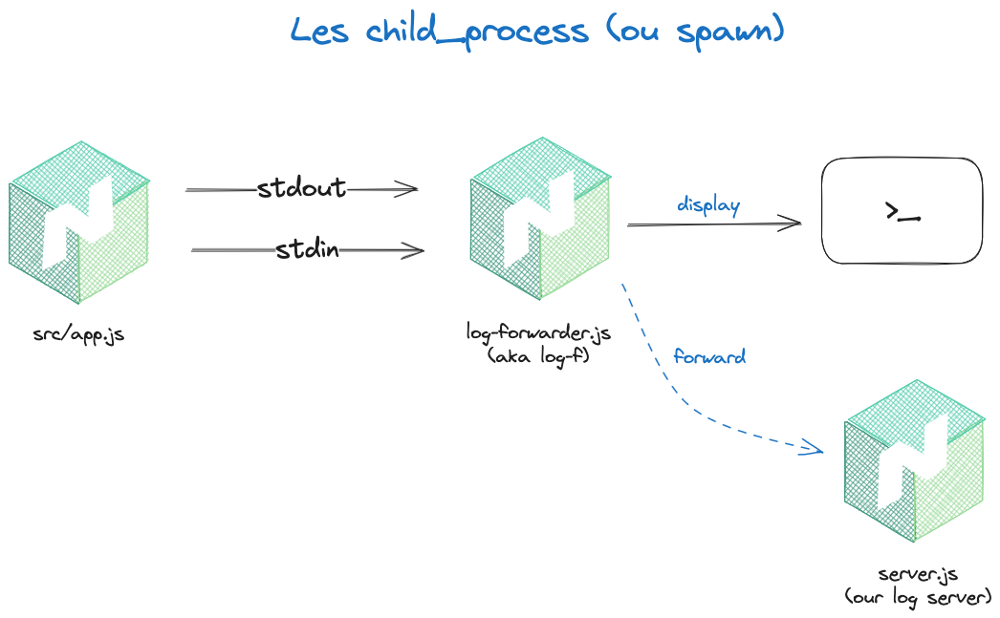

# Child Process (Spawn)
## Introduction

Le spawn Node.js est un processus léger qui peut être utilisé pour exécuter des opérations lourdes sans bloquer le processus principal.
Il est très utile pour lancer plusieurs sous processus en même temps, et ainsi paralléliser des tâches. 
On peut les utiliser dans ces cas :

- lancer deux ou plusieurs processus en parallèle (`exemple` : le module concurrency)
- wrapper un programme externe (exemple : `ts-node`)
- monitorer un processus externe

