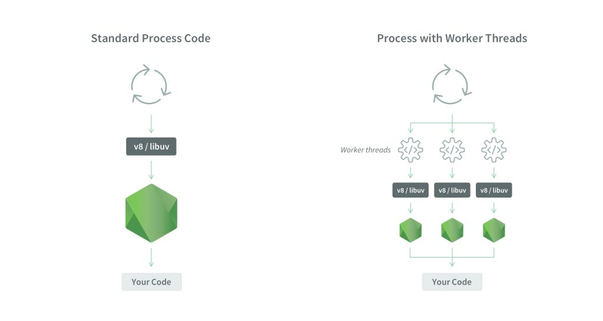

# Worker Threads

> Source: https://i.imgur.com/jSf4o77.jpg

Les worker threads sont un module permettant de créer des threads en JavaScript. (oui oui, des vrais threads !)
Officiellement, ils doivent permettre aux développeurs de traiter des tâches lourdes sans bloquer le processus principal.

Ils auront leurs propres instances de `v8/libuv`, et par conséquence, leurs propres instances de Node.js.

Ils pourront communiquer avec le processus principal par envoi de messages.

Enfin, fromage sur la tartiflette, ils peuvent partager la mémoire via des `SharedArrayBuffer` et `ArrayBuffer`.
