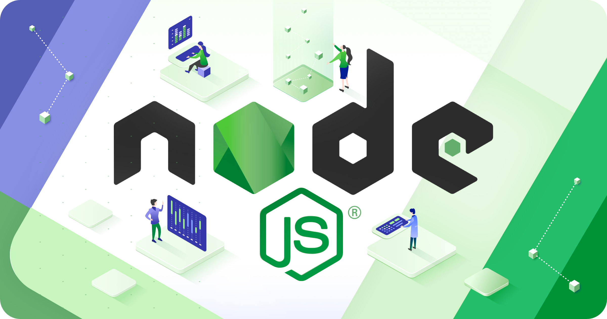

# Node.js: Spawn, Cluster, Workers et Loaders 🫣



- Durée: 45 minutes
- Pré-requis: Node.js 20
- [Présentation](./docs)

## Introduction

Node.js propose énormément de fonctionnalités pour gérer les processus et les threads. 
Dans cette présentation, nous allons nous intéresser à 3 d'entre elles :

- [spawn](./docs/spawn/index.md)
- [cluster](./docs/cluster/index.md)
- [workers](./docs/workers/index.md)

Nous allons voir comment les utiliser et dans quels cas les utiliser.

En complément, nous allons voir comment utiliser les `Loaders` (import depuis Node.js 20) pour 
charger des modules Node.js ne reposant pas sur du code JavaScript natif.

- Loaders: [./packages/loaders/readme.md](./dos/loaders/index.md)

## Installation

```sh
yarn install
# Mais un npm install ou pnpm install marchent aussi ;)
```

## Lancement de la documentation

```sh
yarn run docs:dev
```

## Sources

Voir [./docs/sources.md](./docs/sources.md)

## License

The MIT License (MIT)

Copyright (c) 2024 - Today Romain Lenzotti

Permission is hereby granted, free of charge, to any person obtaining a copy of this software and associated documentation files (the "Software"), to deal in the Software without restriction, including without limitation the rights to use, copy, modify, merge, publish, distribute, sublicense, and/or sell copies of the Software, and to permit persons to whom the Software is furnished to do so, subject to the following conditions:

The above copyright notice and this permission notice shall be included in all copies or substantial portions of the Software.

THE SOFTWARE IS PROVIDED "AS IS", WITHOUT WARRANTY OF ANY KIND, EXPRESS OR IMPLIED, INCLUDING BUT NOT LIMITED TO THE WARRANTIES OF MERCHANTABILITY, FITNESS FOR A PARTICULAR PURPOSE AND NONINFRINGEMENT. IN NO EVENT SHALL THE AUTHORS OR COPYRIGHT HOLDERS BE LIABLE FOR ANY CLAIM, DAMAGES OR OTHER LIABILITY, WHETHER IN AN ACTION OF CONTRACT, TORT OR OTHERWISE, ARISING FROM, OUT OF OR IN CONNECTION WITH THE SOFTWARE OR THE USE OR OTHER DEALINGS IN THE SOFTWARE.
